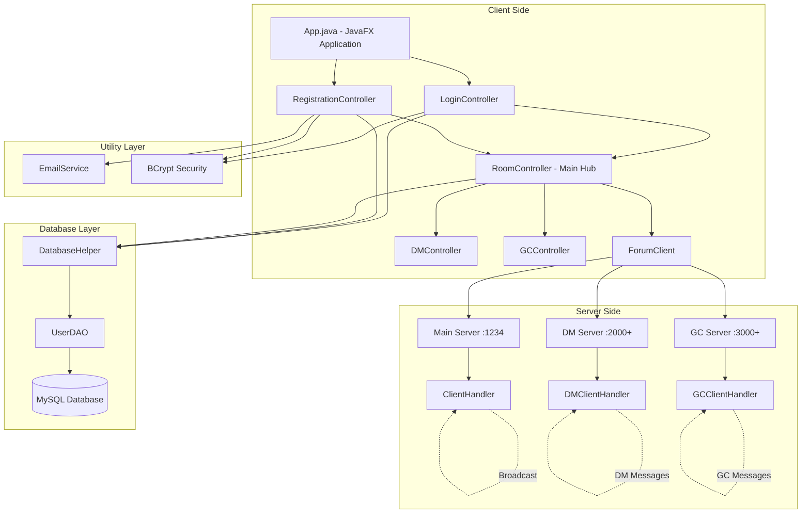
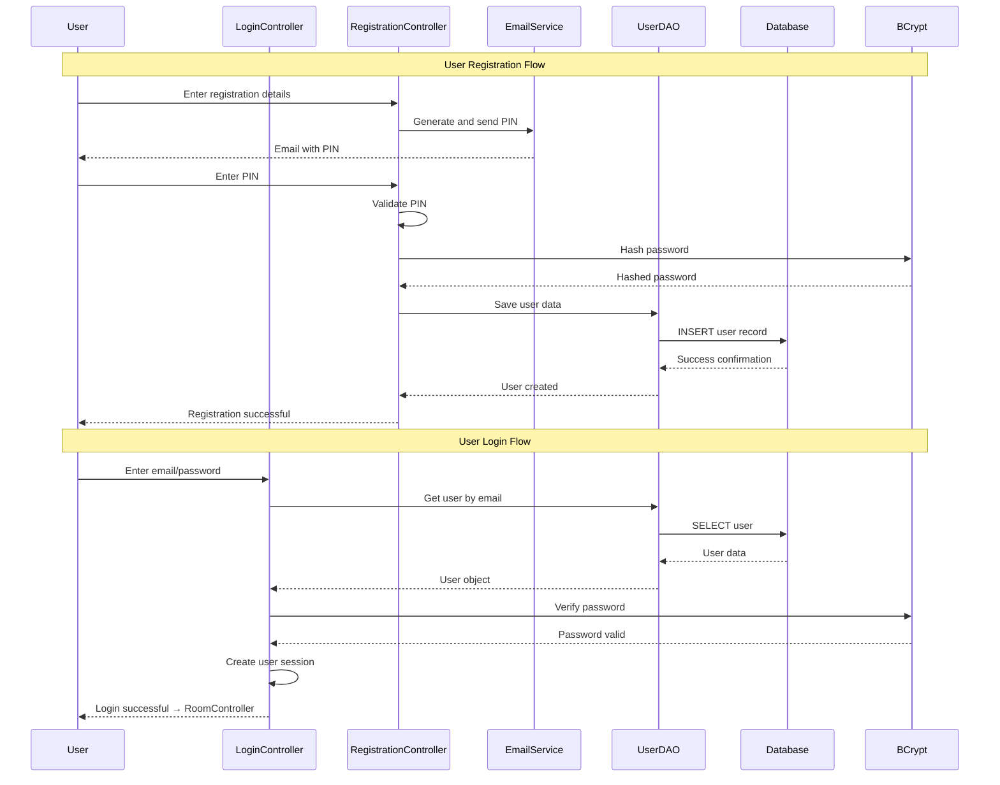
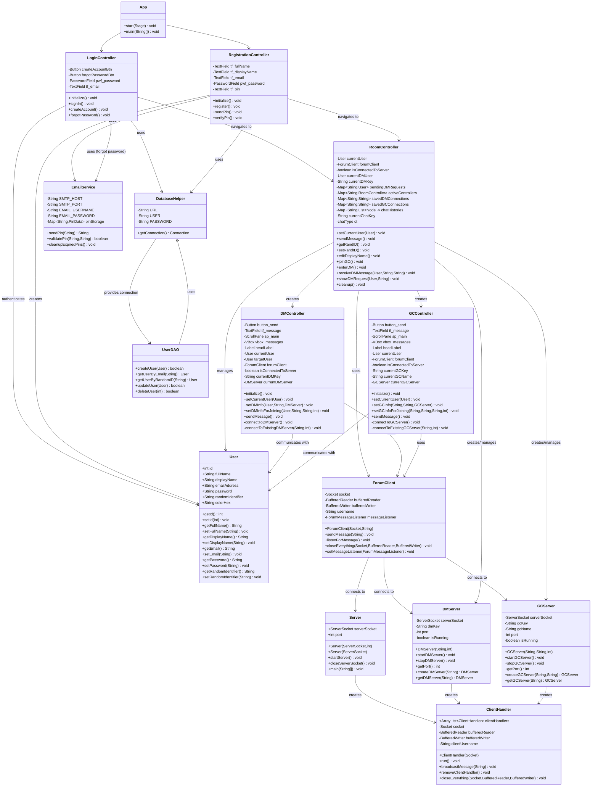
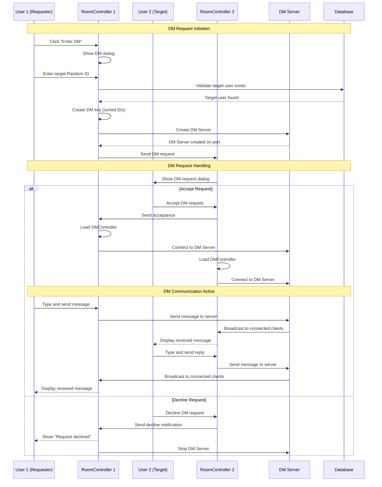
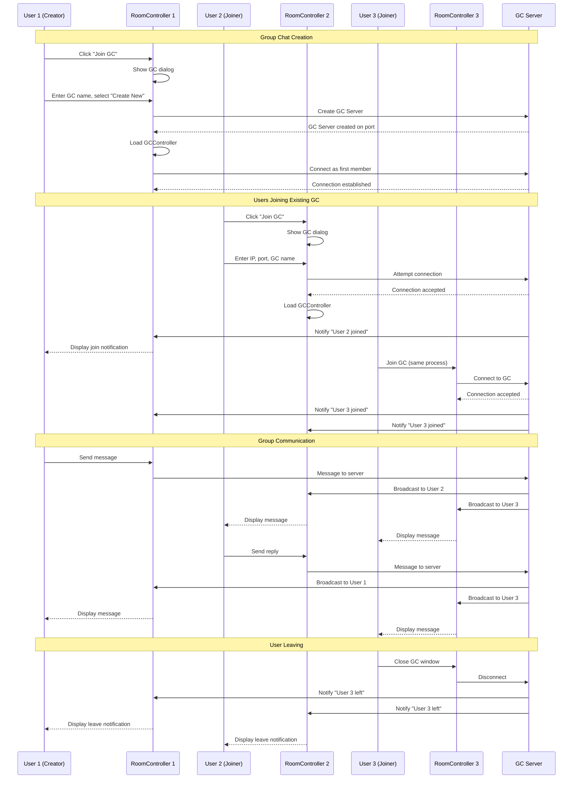
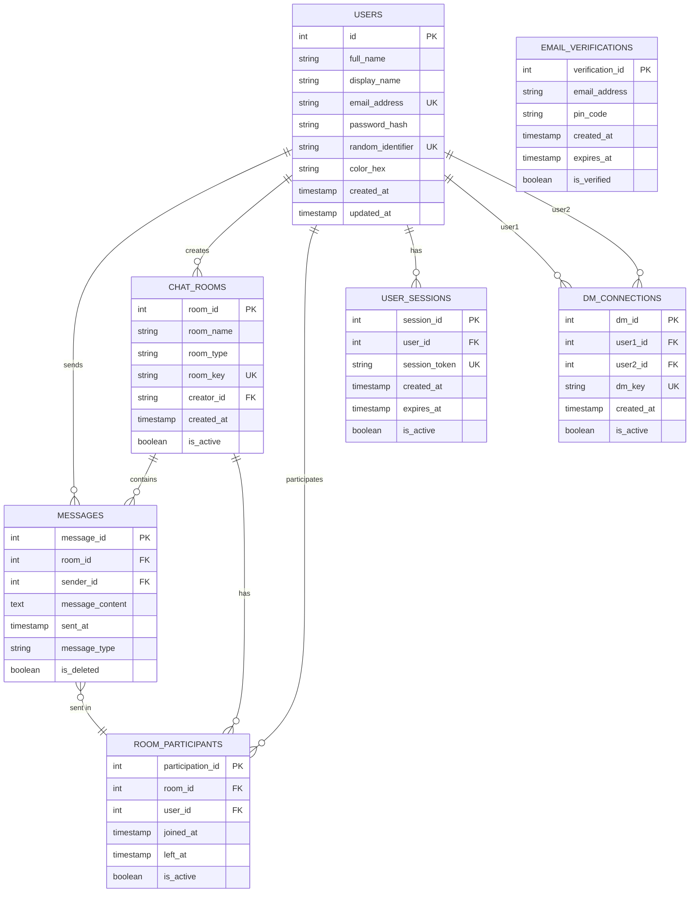

# Tong Chat Application - System Architecture & Design Documentation

## Table of Contents

1. [System Architecture Overview](#system-architecture-overview)
2. [Authentication Flow](#authentication-flow)
3. [Class Diagram](#class-diagram)
4. [Direct Message Flow](#direct-message-flow)
5. [Group Chat Flow](#group-chat-flow)
6. [Database Schema](#database-schema)

---

## 1. System Architecture Overview



### Architecture Components:

#### **Client Side (JavaFX)**

-   **App.java**: Main application entry point, launches login window
-   **Controllers**: Handle UI logic and user interactions
    -   **LoginController**: Authentication interface
    -   **RegistrationController**: User registration with email verification
    -   **RoomController**: Main chat hub, manages DM/GC sessions
    -   **DMController**: Direct message interface
    -   **GCController**: Group chat interface
-   **ForumClient**: Socket client for server communication

#### **Server Side (Multi-threaded)**

-   **Main Server (Port 1234)**: Handles general forum communications
-   **DM Servers (Port 2000+)**: Dynamic servers for each DM session
-   **GC Servers (Port 3000+)**: Dynamic servers for each group chat
-   **Client Handlers**: Process client connections and messages

#### **Data Layer**

-   **DatabaseHelper**: MySQL connection management
-   **UserDAO**: User database operations
-   **MySQL Database**: Persistent data storage

#### **Utility Layer**

-   **EmailService**: Gmail SMTP for email verification
-   **BCrypt**: Password hashing and security

---

## 2. Authentication Flow



### Authentication Features:

-   **Email Verification**: PIN-based verification using Gmail SMTP
-   **Password Security**: BCrypt hashing with salt
-   **Session Management**: User session maintained across controllers
-   **Database Validation**: Secure user lookup and validation

---

## 3. Class Diagram



### Key Class Relationships:

-   **MVC Pattern**: Controllers manage UI and business logic
-   **Client-Server**: ForumClient communicates with multiple server types
-   **Data Access**: DAO pattern for database operations
-   **Utility Services**: EmailService and DatabaseHelper provide shared functionality

---

## 4. Direct Message Flow



### Direct Message Process:

1. **Request Initiation**: User enters target's Random ID
2. **Validation**: System verifies target user exists
3. **Server Creation**: Unique DM server created for conversation
4. **Request Notification**: Target user receives DM request
5. **Acceptance/Decline**: Target user chooses to accept or decline
6. **Connection**: Both users connect to dedicated DM server
7. **Real-time Communication**: Messages exchanged through DM server

---

## 5. Group Chat Flow



### Group Chat Features:

-   **Dynamic Server Creation**: Each GC gets its own server instance
-   **Multi-user Support**: Unlimited users can join a group chat
-   **Real-time Broadcasting**: Messages instantly delivered to all members
-   **Join/Leave Notifications**: Users notified when others join or leave
-   **Persistent Sessions**: GC servers remain active while users are connected

---

## 6. Database Schema



### Database Schema Details:

#### **USERS Table**

-   **Primary Data**: User account information
-   **Security**: Hashed passwords, unique random identifiers
-   **Customization**: Display names, color preferences

#### **CHAT_ROOMS Table**

-   **Room Management**: Stores DM and GC room information
-   **Types**: "DM" for direct messages, "GC" for group chats
-   **Keys**: Unique room identifiers for server mapping

#### **MESSAGES Table**

-   **Message Storage**: All chat messages with metadata
-   **Relationships**: Links to users and rooms
-   **Features**: Soft delete, message types

#### **ROOM_PARTICIPANTS Table**

-   **Membership Tracking**: User participation in rooms
-   **History**: Join/leave timestamps
-   **Status**: Active participation status

#### **DM_CONNECTIONS Table**

-   **Direct Message Mapping**: Links two users in DM
-   **Unique Keys**: Prevents duplicate DM sessions
-   **Status Tracking**: Active/inactive DM connections

---

## 7. Technology Stack Deep Dive

### Frontend Architecture

-   **JavaFX**: Modern UI framework with FXML layouts
-   **FXML Controllers**: MVC pattern implementation
-   **Scene Management**: Dynamic window creation for chats
-   **AnimateFX**: Smooth UI transitions and animations

### Backend Architecture

-   **Socket Programming**: TCP connections for real-time communication
-   **Multi-threading**: Concurrent client handling
-   **Dynamic Server Creation**: On-demand DM/GC servers
-   **Connection Pooling**: Efficient resource management

### Security Implementation

-   **BCrypt**: Industry-standard password hashing
-   **Email Verification**: PIN-based account validation
-   **Session Management**: Secure user session handling
-   **Input Validation**: Comprehensive data sanitization

### Database Design

-   **MySQL**: Reliable relational database
-   **Connection Pooling**: Efficient database access
-   **DAO Pattern**: Clean data access layer
-   **Prepared Statements**: SQL injection prevention

---

## 8. Communication Protocols

### Message Format

```json
{
	"type": "message|notification|system",
	"sender": "username",
	"content": "message content",
	"timestamp": "2024-01-01T12:00:00Z",
	"room_id": "chat_room_identifier"
}
```

### Server Communication

-   **Port 1234**: Main forum server
-   **Port 2000+**: Dynamic DM servers
-   **Port 3000+**: Dynamic GC servers
-   **Protocol**: TCP socket connections
-   **Encoding**: UTF-8 text messages

---
