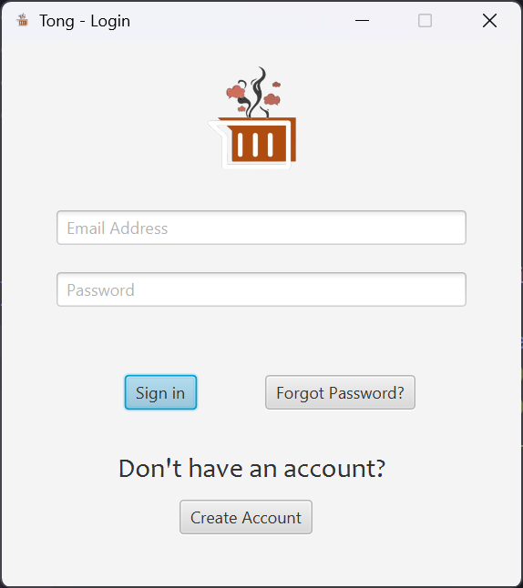
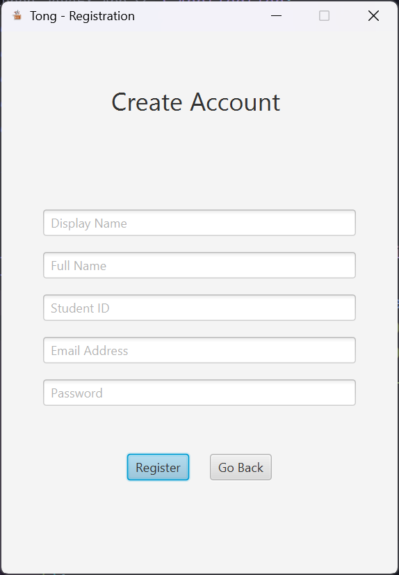
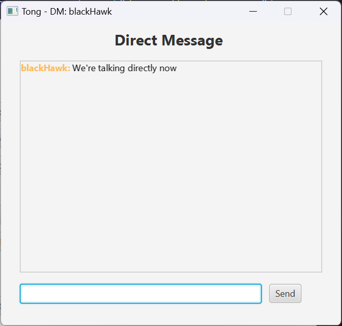
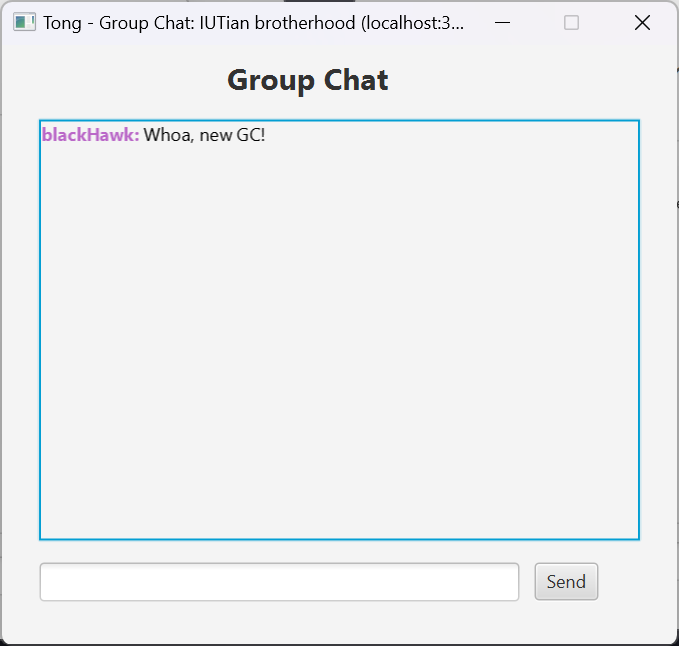
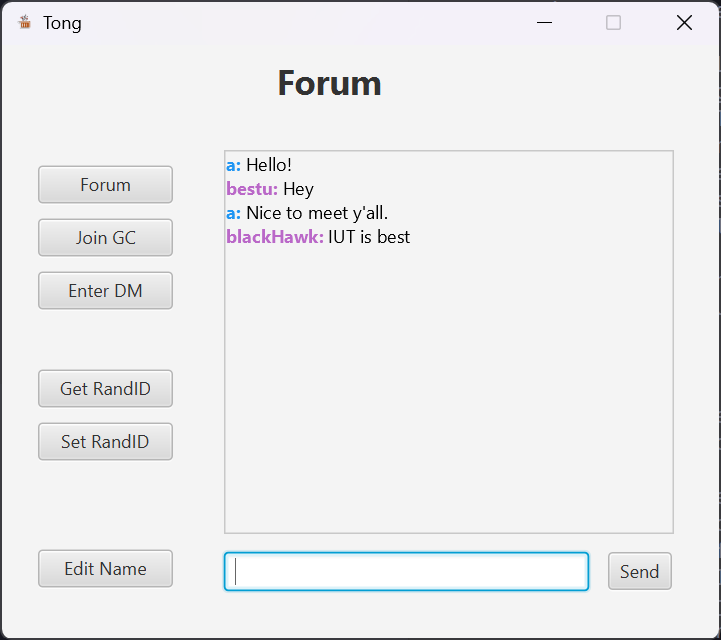

# Tong - IUT Chat Application

A JavaFX-based real-time messaging application designed for university students to communicate through direct messages and group chats.


#### 🏗️ Architecture & Design

For detailed system architecture, flowcharts, and class diagram- 🛠️ **Technology Stack Deep Dive**: Technical implementation details
- 🖼️ **Visual Diagram Images**: PNG exports in `Architecture Diagrams/` folder, see:
**[📐 ARCHITECTURE_DIAGRAMS.md](ARCHITECTURE_DIAGRAMS.md)**

This comprehensive documentation includes:

-   System Architecture Overview
-   Authentication Flow Diagrams
-   Complete Class Diagrams
-   Direct Message Flow Charts
-   Group Chat Process Flows
-   Database Schema Design
-   Technology Stack Deep Dive
-   Visual Diagram Images (PNG in Architecture Diagrams/ folder)

## 🤝 Contributing

1. Fork the repository
2. Create a feature branch (`git checkout -b feature/AmazingFeature`)
3. Commit your changes (`git commit -m 'Add some AmazingFeature'`)
4. Push to the branch (`git push origin feature/AmazingFeature`)
5. Open a Pull Requesttures

-   **User Authentication**: Secure login and registration system with email verification
-   **Direct Messaging**: Private one-on-one conversations
-   **Group Chat**: Multi-user chat rooms for discussions
-   **Real-time Communication**: Instant message delivery using socket programming
-   **Email Verification**: PIN-based email verification for account security
-   **User Profiles**: Customizable user profiles with display names
-   **Modern UI**: Clean and intuitive JavaFX interface

## 📸 Screenshots

<div align="center">

### 🔐 Authentication Flow

|              Login Interface              |                Registration Process                 |
| :---------------------------------------: | :-------------------------------------------------: |
|     |       |
| _Secure email-based login with modern UI_ | _Step-by-step registration with email verification_ |

### 💬 Messaging Interfaces

|                   Direct Messages                   |                Group Chat                |              Forum Selection              |
| :-------------------------------------------------: | :--------------------------------------: | :---------------------------------------: |
|  |  |  |
|         _Private one-on-one conversations_          |      _Multi-user group discussions_      |      _Main hub for chat navigation_       |

</div>

## 🛠️ Technology Stack

<div align="center">

| Layer            | Technology                  | Purpose                         |
| ---------------- | --------------------------- | ------------------------------- |
| **Frontend**     | JavaFX 17+ with FXML        | Modern desktop UI framework     |
| **Backend**      | Java 11+ Socket Programming | Real-time TCP communication     |
| **Database**     | MySQL 8.0+                  | Persistent data storage         |
| **Security**     | BCrypt                      | Password hashing & verification |
| **Email**        | JavaMail API + Gmail SMTP   | Account verification system     |
| **Animations**   | AnimateFX                   | Smooth UI transitions           |
| **Build System** | JAR Dependencies            | Lightweight deployment          |
| **Architecture** | MVC Pattern                 | Clean code organization         |

</div>

### 📦 Core Dependencies

-   **JavaFX**: `javafx-controls`, `javafx-fxml`, `javafx-graphics`
-   **Database**: `mysql-connector-j-9.4.0`
-   **Security**: `bcrypt-0.7.0`
-   **Email**: `jakarta.mail-1.6.3`, `jakarta.activation-2.0.1`
-   **UI**: `AnimateFX-1.3.0`
-   **Utilities**: `gson-2.13.1`, `commons-lang3-3.18.0`

## ⚡ Quick Start

```bash
# 1. Clone the repository
git clone https://github.com/MubtasimSajid/Tong.git
cd Tong

# 2. Set up MySQL database
mysql -u root -p -e "CREATE DATABASE tongchat;"

# 3. Configure credentials (see Installation & Setup)
# Edit src/database/DatabaseHelper.java
# Edit src/utils/EmailService.java

# 4. Compile the application
javac -cp "lib/*" -d bin src/**/*.java

# 5. Run the server (Terminal 1)
java -cp "bin;lib/*" server.Server

# 6. Run the client (Terminal 2)
java -cp "bin;lib/*" --module-path "lib" --add-modules javafx.controls,javafx.fxml App
```

## 📋 Prerequisites

| Requirement       | Version | Purpose                                   |
| ----------------- | ------- | ----------------------------------------- |
| **Java JDK**      | 11+     | Core runtime environment                  |
| **JavaFX**        | 17+     | UI framework (if not bundled with JDK)    |
| **MySQL Server**  | 8.0+    | Database for user data and messages       |
| **Gmail Account** | -       | SMTP for email verification (2FA enabled) |

## 🔧 Installation & Setup

### 1. Database Configuration

**Step 1: Install MySQL Server**

```bash
# On Windows (using chocolatey)
choco install mysql

# On macOS (using homebrew)
brew install mysql

# On Ubuntu/Debian
sudo apt-get install mysql-server
```

**Step 2: Create Database**

```sql
mysql -u root -p
CREATE DATABASE tongchat;
USE tongchat;
-- Tables will be auto-created by the application
EXIT;
```

**Step 3: Configure Database Connection**
Edit `src/database/DatabaseHelper.java`:

```java
private static final String URL = "jdbc:mysql://localhost:3306/tongchat";
private static final String USER = "your_database_username";
private static final String PASSWORD = "your_database_password";
```

### 2. Email Service Setup

**Step 1: Gmail SMTP Configuration**
Edit `src/utils/EmailService.java`:

```java
private static final String EMAIL_USERNAME = "your_email@gmail.com";
private static final String EMAIL_PASSWORD = "your_gmail_app_password";
```

**Step 2: Generate Gmail App Password**

1. Go to [Google Account Settings](https://myaccount.google.com/)
2. Navigate to **Security** → **2-Step Verification** → **App passwords**
3. Select **Mail** and generate a 16-character password
4. Use this password in the `EMAIL_PASSWORD` field

> ⚠️ **Security Note**: Never use your actual Gmail password. Always use App Passwords for applications.

### 3. Dependencies Management

All required JAR files are included in the `lib/` folder. No additional downloads needed.

<details>
<summary>📦 View Complete Dependencies List</summary>

| Category            | JAR File                     | Version | Purpose                    |
| ------------------- | ---------------------------- | ------- | -------------------------- |
| **JavaFX Core**     | javafx.base.jar              | 17+     | Base JavaFX functionality  |
| **JavaFX UI**       | javafx.controls.jar          | 17+     | UI controls and components |
| **JavaFX FXML**     | javafx.fxml.jar              | 17+     | FXML layout support        |
| **JavaFX Graphics** | javafx.graphics.jar          | 17+     | Graphics and rendering     |
| **Database**        | mysql-connector-j-9.4.0.jar  | 9.4.0   | MySQL JDBC driver          |
| **Email**           | jakarta.mail-1.6.3.jar       | 1.6.3   | Email functionality        |
| **Email Support**   | jakarta.activation-2.0.1.jar | 2.0.1   | Email activation framework |
| **Security**        | bcrypt-0.7.0.jar             | 0.7.0   | Password hashing           |
| **Animations**      | AnimateFX-1.3.0.jar          | 1.3.0   | UI animations              |
| **JSON**            | gson-2.13.1.jar              | 2.13.1  | JSON serialization         |
| **Utilities**       | commons-lang3-3.18.0.jar     | 3.18.0  | Common utilities           |

</details>

### 4. Build & Run

#### Option A: Command Line (Recommended)

```bash
# 1. Compile all source files
javac -cp "lib/*" -d bin src/**/*.java

# 2. Start the server (keep this terminal open)
java -cp "bin;lib/*" server.Server

# 3. In a new terminal, start the client application
java -cp "bin;lib/*" --module-path "lib" --add-modules javafx.controls,javafx.fxml App
```

#### Option B: VS Code IDE

1. **Install Extensions**:

    - [Java Extension Pack](https://marketplace.visualstudio.com/items?itemName=vscjava.vscode-java-pack)
    - [JavaFX Support](https://marketplace.visualstudio.com/items?itemName=eleventiggers.bootstrap-javafx)

2. **Configure Launch**:
    - Open project in VS Code
    - Use `Ctrl+Shift+P` → "Java: Debug"
    - First run `Server.java`, then `App.java`

#### Option C: IntelliJ IDEA

1. **Import Project**: File → Open → Select Tong folder
2. **Configure Libraries**: Add all JARs from `lib/` folder to classpath
3. **Run Configuration**:
    - Main class: `server.Server` (for server)
    - Main class: `App` (for client)
    - VM options: `--module-path lib --add-modules javafx.controls,javafx.fxml`

## 📁 Project Structure

```
Tong/
├── Architecture Diagrams/          # Visual diagrams (PNG from Mermaid)
├── src/
│   ├── App.java                    # Main application entry point
│   ├── client/                     # Client-side networking
│   │   ├── ClientHandler.java
│   │   ├── DMClientHandler.java
│   │   ├── ForumClient.java
│   │   └── GCClientHandler.java
│   ├── controllers/                # JavaFX Controllers
│   │   ├── DMController.java
│   │   ├── GCController.java
│   │   ├── LoginController.java
│   │   ├── RegistrationController.java
│   │   └── RoomController.java
│   ├── database/                   # Database utilities
│   │   ├── DatabaseHelper.java
│   │   └── UserDAO.java
│   ├── models/                     # Data models
│   │   └── User.java
│   ├── server/                     # Server-side networking
│   │   ├── DMServer.java
│   │   ├── GCServer.java
│   │   └── Server.java
│   ├── utils/                      # Utility classes
│   │   └── EmailService.java
│   └── views/                      # FXML UI files
│       ├── dm.fxml
│       ├── gc.fxml
│       ├── login.fxml
│       ├── profile.fxml
│       ├── register.fxml
│       ├── room.fxml
│       └── tongLogo.png
├── Screenshots/                    # Application screenshots
├── lib/                            # External dependencies
└── bin/                            # Compiled classes
```

## 🏗️ Architecture & Design

### 📐 Comprehensive Technical Documentation

For detailed system architecture, flowcharts, and class diagrams, see:
**[📊 ARCHITECTURE_DIAGRAMS.md](ARCHITECTURE_DIAGRAMS.md)**

**Visual Diagrams**: All Mermaid diagrams are also available as images in the **[Architecture Diagrams/](Architecture%20Diagrams/)** directory for easy viewing and presentations.

<details>
<summary>🔍 Architecture Overview</summary>

#### System Components:

-   **Client Layer**: JavaFX controllers and UI components
-   **Network Layer**: Socket-based client-server communication
-   **Server Layer**: Multi-threaded servers (Main, DM, GC)
-   **Data Layer**: MySQL database with DAO pattern
-   **Security Layer**: BCrypt hashing and email verification

#### Key Design Patterns:

-   **MVC (Model-View-Controller)**: Clean separation of concerns
-   **DAO (Data Access Object)**: Database abstraction layer
-   **Observer Pattern**: Real-time message updates
-   **Factory Pattern**: Dynamic server creation
-   **Singleton Pattern**: Database connection management

</details>

This documentation includes:

-   🏗️ **System Architecture Overview**: Complete system design
-   🔐 **Authentication Flow Diagrams**: Login and registration processes
-   📊 **Complete Class Diagrams**: All classes, methods, and relationships
-   💬 **Message Flow Charts**: DM and GC communication flows
-   🗄️ **Database Schema Design**: Complete ERD and table structures
-   🛠️ **Technology Stack Deep Dive**: Technical implementation details

## 📖 Usage Guide

### 🚀 Getting Started

#### 1. Account Creation

```
📝 Registration Flow:
Launch App → "Create Account" → Fill Details → Email Verification → Complete Setup
```

-   **Full Name**: Your real name for identification
-   **Display Name**: How others see you in chats
-   **Email**: Must be valid for PIN verification
-   **Password**: Securely hashed with BCrypt

#### 2. Authentication

```
🔐 Login Process:
Enter Email → Enter Password → Verify Credentials → Access Main Hub
```

### 💬 Messaging Features

#### Direct Messages (DM)

1. **Initiate DM**: Click "Enter DM" → Enter target user's Random ID
2. **Accept/Decline**: Target user receives request notification
3. **Chat**: Dedicated server created for your conversation
4. **Features**: Real-time messaging, chat history, connection status

#### Group Chats (GC)

1. **Create GC**: Click "Join GC" → "Create New" → Enter group name
2. **Join Existing**: Enter IP, port, and group name from creator
3. **Participate**: Multi-user real-time conversation
4. **Features**: Join/leave notifications, message broadcasting

#### User Management

-   **Random ID**: Unique identifier for DM requests (Get/Set via buttons)
-   **Display Name**: Editable username for chat display
-   **Profile**: Customizable user information and preferences

## 🔒 Security Features

| Security Layer          | Implementation      | Purpose                                          |
| ----------------------- | ------------------- | ------------------------------------------------ |
| **Password Security**   | BCrypt Hashing      | Industry-standard password encryption with salt  |
| **Email Verification**  | PIN-based SMTP      | Prevents unauthorized account creation           |
| **Session Management**  | Secure Tokens       | Maintains user authentication across controllers |
| **Input Validation**    | Client & Server     | Prevents injection attacks and data corruption   |
| **Connection Security** | TCP Sockets         | Secure client-server communication               |
| **Database Security**   | Prepared Statements | SQL injection prevention                         |

### 🛡️ Security Best Practices

-   ✅ **No Plain Text Passwords**: All passwords hashed with BCrypt
-   ✅ **Email Verification Required**: PIN-based account activation
-   ✅ **Session Timeout**: Automatic session management
-   ✅ **Input Sanitization**: Comprehensive validation on all user inputs
-   ✅ **Secure Configuration**: Credentials separated from source code

## 🗄️ Database Schema

The application uses a normalized MySQL database with the following structure:

<details>
<summary>📊 View Database Tables</summary>

| Table                   | Primary Key        | Purpose                      | Relationships                      |
| ----------------------- | ------------------ | ---------------------------- | ---------------------------------- |
| **USERS**               | `id`               | User account information     | One-to-many with MESSAGES          |
| **MESSAGES**            | `message_id`       | Chat message storage         | Many-to-one with USERS, CHAT_ROOMS |
| **CHAT_ROOMS**          | `room_id`          | DM and GC room management    | One-to-many with MESSAGES          |
| **ROOM_PARTICIPANTS**   | `participation_id` | User-room membership         | Many-to-many bridge table          |
| **DM_CONNECTIONS**      | `dm_id`            | Direct message relationships | Links two users                    |
| **EMAIL_VERIFICATIONS** | `verification_id`  | PIN verification tracking    | Temporary verification data        |

</details>

## ⚙️ Server Architecture

### 🌐 Multi-Server Design

```
Main Server (Port 1234)
├── Forum Client Connections
├── User Authentication
└── General Communications

Dynamic DM Servers (Port 2000+)
├── Dedicated per DM session
├── Two-user private communication
└── Auto-cleanup on disconnect

Dynamic GC Servers (Port 3000+)
├── Multi-user group sessions
├── Real-time message broadcasting
└── Join/leave notifications
```

### 🔄 Connection Flow

1. **Client Connect** → Main Server (Authentication)
2. **DM Request** → Create DM Server → Connect both users
3. **GC Request** → Create/Join GC Server → Multi-user connect
4. **Real-time Messaging** → Dedicated server handles communication

## 🎨 UI Components

| Component              | Technology       | Features                           |
| ---------------------- | ---------------- | ---------------------------------- |
| **Login/Registration** | JavaFX + FXML    | Clean forms, validation feedback   |
| **Main Chat Hub**      | Scene Controller | DM/GC navigation, user management  |
| **Message Windows**    | Dynamic Scenes   | Real-time updates, chat history    |
| **Animations**         | AnimateFX        | Smooth transitions, modern feel    |
| **Responsive Design**  | JavaFX Layouts   | Adaptive to different screen sizes |

## 📡 API Reference

### Core Communication Protocols

<details>
<summary>🌐 Network Protocol Details</summary>

#### Message Format

```json
{
	"type": "message|notification|system",
	"sender": "username",
	"content": "message content",
	"timestamp": "2024-01-01T12:00:00Z",
	"room_id": "chat_room_identifier"
}
```

#### Server Endpoints

-   **Main Server**: `localhost:1234` - General forum communication
-   **DM Servers**: `localhost:2000+` - Dynamic direct message servers
-   **GC Servers**: `localhost:3000+` - Dynamic group chat servers

#### Connection Lifecycle

1. **Handshake**: Client sends username on connection
2. **Authentication**: Server validates user session
3. **Message Loop**: Continuous message listening/sending
4. **Cleanup**: Graceful disconnect and resource cleanup

</details>

## 🔧 Troubleshooting

<details>
<summary>❗ Common Issues & Solutions</summary>

### Database Connection Issues

```bash
Problem: "Connection refused" or "Access denied"
Solution:
1. Verify MySQL server is running
2. Check database credentials in DatabaseHelper.java
3. Ensure tongchat database exists
4. Verify user has proper permissions
```

### JavaFX Runtime Issues

```bash
Problem: "Module javafx.controls not found"
Solution:
1. Add JavaFX to module path: --module-path "lib"
2. Add required modules: --add-modules javafx.controls,javafx.fxml
3. Ensure JavaFX JARs are in lib/ folder
```

### Email Service Issues

```bash
Problem: "Authentication failed" for Gmail
Solution:
1. Enable 2-Factor Authentication on Gmail
2. Generate App Password (not regular password)
3. Use App Password in EmailService.java
4. Check Gmail security settings
```

### Port Conflicts

```bash
Problem: "Address already in use"
Solution:
1. Check if another instance is running
2. Kill existing Java processes: taskkill /f /im java.exe
3. Change port numbers in Server.java if needed
```

### Diagram Viewing Issues

```bash
Problem: Mermaid diagrams not rendering in ARCHITECTURE_DIAGRAMS.md
Solution:
1. Use GitHub's web interface (auto-renders Mermaid)
2. View exported images in Architecture Diagrams/ folder
3. Use VS Code with Mermaid Preview extension
4. Export to PNG/SVG using Mermaid CLI or online editor
```

</details>

## 🤝 Contributing

We welcome contributions from the community! Here's how you can help improve Tong:

### 🚀 Quick Start for Contributors

```bash
# 1. Fork and clone
git clone https://github.com/your-username/Tong.git
cd Tong

# 2. Create feature branch
git checkout -b feature/amazing-feature

# 3. Make your changes
# ... edit code ...

# 4. Test thoroughly
# ... run tests ...

# 5. Commit with conventional format
git commit -m "feat: add amazing new feature"

# 6. Push and create PR
git push origin feature/amazing-feature
```

### 📋 Contribution Guidelines

<details>
<summary>🔍 Development Guidelines</summary>

#### Code Style

-   Follow Java naming conventions (camelCase, PascalCase)
-   Use meaningful variable and method names
-   Add JavaDoc comments for public methods
-   Maintain consistent indentation (4 spaces)

#### Testing Requirements

-   Test all new features thoroughly
-   Verify database operations work correctly
-   Test both client and server components
-   Check UI responsiveness and functionality

#### Commit Message Format

```
type(scope): description

Examples:
feat(messaging): add group chat functionality
fix(database): resolve connection timeout issue
docs(readme): update installation instructions
style(ui): improve login form styling
```

#### Pull Request Process

1. Ensure your PR has a clear title and description
2. Reference any related issues (#123)
3. Include screenshots for UI changes
4. Update documentation if needed
5. Request review from maintainers

</details>

### 🎯 Areas for Contribution

| Area                 | Skill Level  | Examples                                   |
| -------------------- | ------------ | ------------------------------------------ |
| **🐛 Bug Fixes**     | Beginner     | Fix UI glitches, resolve connection issues |
| **✨ Features**      | Intermediate | File sharing, emoji support, themes        |
| **🏗️ Architecture**  | Advanced     | Performance optimization, scalability      |
| **📚 Documentation** | Any          | Tutorials, API docs, code comments         |
| **🧪 Testing**       | Intermediate | Unit tests, integration tests              |
| **🎨 UI/UX**         | Designer     | Modern themes, responsive design           |

### 📞 Get in Touch

-   🐛 **Report Bugs**: [Create an Issue](../../issues/new?template=bug_report.md)
-   💡 **Suggest Features**: [Feature Request](../../issues/new?template=feature_request.md)
-   💬 **Ask Questions**: [Start a Discussion](../../discussions)
-   📧 **Contact**: Open an issue for any questions

## 📄 License

This project is licensed under the **MIT License** - see the [LICENSE](LICENSE) file for details.

### 📜 License Summary

-   ✅ **Commercial use** - Use in commercial projects
-   ✅ **Modification** - Modify and adapt the code
-   ✅ **Distribution** - Share and distribute freely
-   ✅ **Private use** - Use for personal projects
-   ❗ **Include license** - Must include original license

## 🙏 Acknowledgments

### 🛠️ Built With

-   **[JavaFX](https://openjfx.io/)** - Modern Java UI toolkit
-   **[MySQL](https://www.mysql.com/)** - Reliable database system
-   **[BCrypt](https://github.com/patrickfav/bcrypt)** - Secure password hashing
-   **[AnimateFX](https://github.com/Typhon0/AnimateFX)** - Beautiful animations
-   **[Jakarta Mail](https://eclipse-ee4j.github.io/mail/)** - Email functionality

### 💡 Inspiration

-   Modern chat applications like Discord and Slack
-   University communication needs and requirements
-   Real-time system design principles
-   Clean architecture and design patterns

### 🎓 Educational Value

This project demonstrates:

-   **Socket Programming** - Real-time client-server communication
-   **Multi-threading** - Concurrent user handling
-   **Database Design** - Normalized schema and DAO pattern
-   **Security Implementation** - Authentication and encryption
-   **UI/UX Design** - Modern JavaFX applications
-   **Software Architecture** - MVC and design patterns

---

<div align="center">

**⭐ Star this repository if you found it helpful!**

**Made with ❤️ for real-time communication**


---

**🔒 Security Notice**: Always configure your database and email credentials properly. Never commit sensitive information to version control. Use environment variables or separate configuration files for production deployments.

</div>
